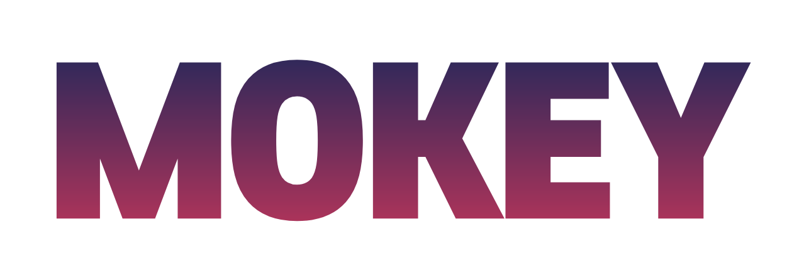

# 모두의 검색어, 모키

## 프로젝트 개요

 	
	

## **기획의도**

- 블로그를 작성하거나 유튜브를 제작할 때 **최신 트렌드**를 파악하는데 어려움을 겪습니다.
- 키워드별로 **검색 트래픽**을 조회하고, **검색량 대비 발행량**을 체크해야 효율적인 글쓰기가 가능합니다.
- 트렌드 키워드별로 **정보의 불균형**이 존재하며, **모키는 이 부분을 해결하는 애플리케이션 입니다.**

## **🚀️ 배포링크 : https://www.mokey.net**

## 🛠️ **Tech Stack**

    
    
    
    
    
    
    
    
    
    
    
    

